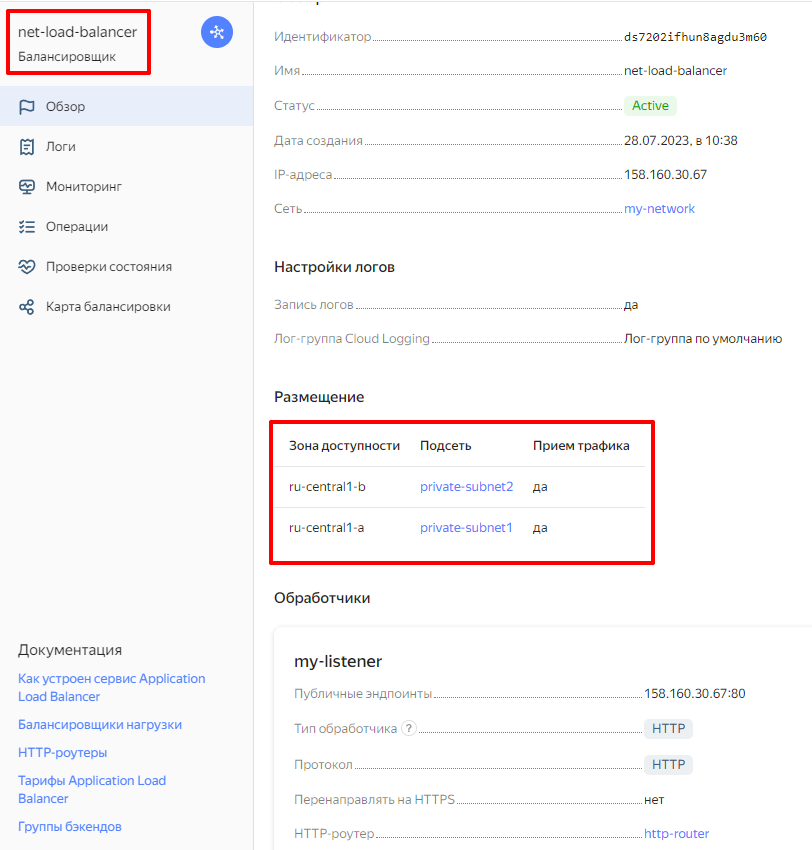
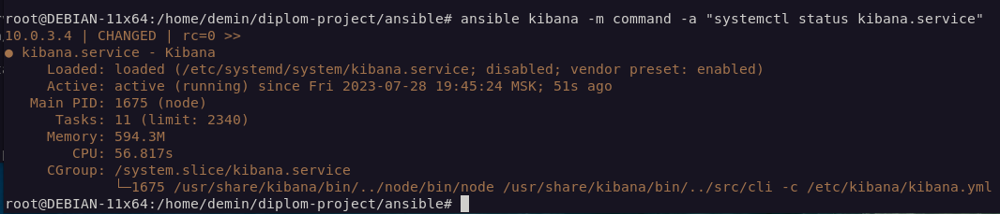

# Дипломная работа по специальности «Системный администратор», студент Андрей Демин

### 1. Создание инфраструктуры в yandex-cloud

Структура рабочего каталога terraform:


Примечание: в целях безопасности из каталога удален файл **diplom.auto.tfvars**, содержащий **access_token** 


Результаты развертывания инфраструктуры:

а) общее состояние


---
б) состояние виртуальных хостов


---
в) сетевой балансировщик


---
г) частная подсеть 1   


---
д) частная подсеть 2


---
е) публичная подсеть


---
ж) публичные ip-адреса


---
з) резевное копирование с помощью снэпшотов


### 2. Развертывание ПО и его настройка в инфраструктуре 

Структура рабочего каталога ansible:


Структура рабочего каталога для конфигурационных файлов:


Проверка доступности ресурсов:

```
ansible -i hosts.ini all -m ping
```


Проверка наличия проблемных сервисов:

```
ansible all -m command -a "systemctl list-units --type service --state failed"
```


Примечание: инвентарный файл **hosts.ini** создается при развертывании инфраструктуры
из файла **../terraform/inventory.tf** 


Результаты выполнения **ansible playbooks**:

1. Настройка веб-серверов 

На веб-серверах установлены сервисы:

а) Nginx

б) Node Exporter

в) Nginx Log Exporter

г) Filebeat

Проверка состояния сервисов:

```
ansible web -m command -a "systemctl list-units --type service --state running"
```
Результат: 
 

---


2. Проверка работы сетевого балансировщика и доступности веб-серверов и сайта

```
curl -v 158.160.30.67:80
```


---

---

---


Примечание: для проверки доступности сайта на втором сервере понадобилось остановить первый сервер
в веб-панели yandex-cloud


3. Настройка систем мониторинга

Проверка состояния сервисов на хосте **prometheus**:

```
ansible prometheus -m command -a "systemctl list-units --type service --state running"
```
Результат:


Проверка работоспособности сайта **grafana**, состояние **dashboards**


---

---


Примечание: экспорт состояния дашбордов сохранен в **config/dashboards.json**
Логин и пароль к сайту оставлены по-умолчанию (admin:admin)

4. Настройка систем логирования

Проверка состояния сервисов на хосте **elasticsearch**:

```
ansible elasticsearch -m command -a "systemctl status elasticsearch.service"
```
Результат:


Проверка состояния сервисов на хосте **kibana**:

```
ansible kibana -m command -a "systemctl status kibana.service"
```
Результат:



Состояние мониторинга логов:


---

---

---


Примечание: для системы доставки, хранения, обработки и визуализации логов 
использованы deb. дистрибутивы **filebeat, elasticsearch, kibana** версии 7.17.9

